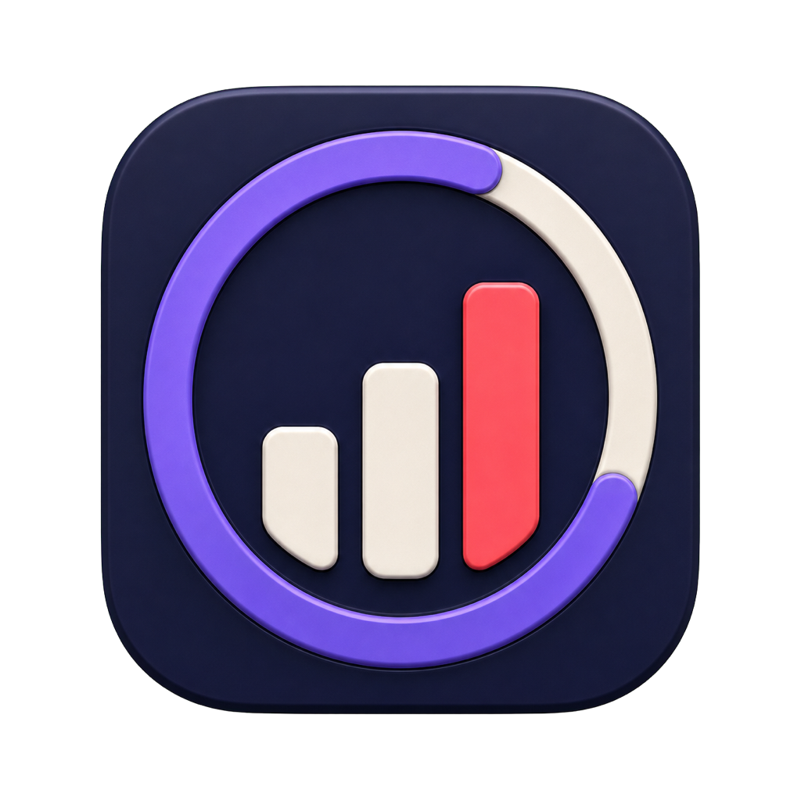
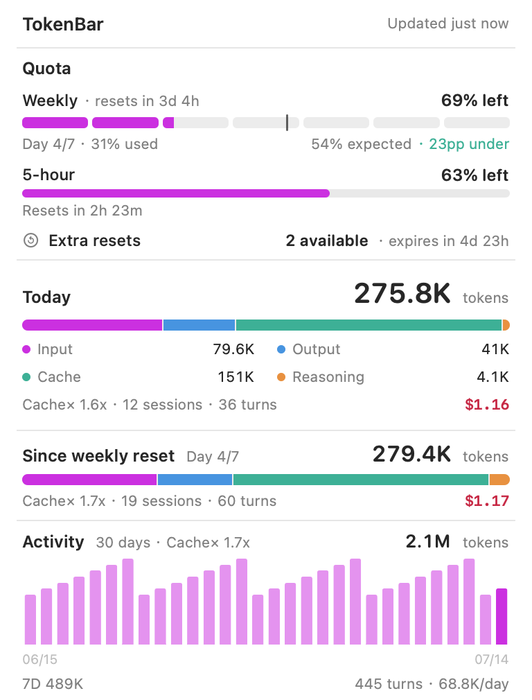
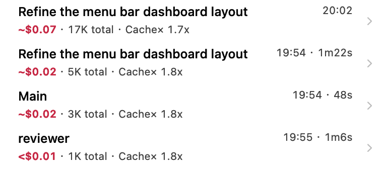

<p align="center">
  
</p>

<h1 align="center">TokenBar</h1>

<p align="center">
  Codex quota and token activity, at a glance in your macOS menu bar.
</p>

<p align="center">
  
  
  
  <a href="LICENSE"></a>
</p>

<p align="center">
  
</p>

TokenBar is a native, standalone macOS menu bar app focused on Codex. It combines live quota windows with local token accounting, cost estimates, session history, user turns, and main/subagent request details. It does not require CodexBar or Tokscale to build or run.

> TokenBar is an independent project and is not affiliated with or endorsed by OpenAI.

## Highlights

- See today's token total and remaining weekly quota directly in the menu bar.
- Track weekly and available 5-hour quota windows, their reset times, and extra reset credits. The 5-hour row stays hidden when Codex does not return that window.
- Compare weekly usage with a linear seven-segment pace calculated from the last weekly reset.
- Review today and since-weekly-reset totals for input, output, cache, reasoning, estimated cost, sessions, and turns.
- Explore 7-day and 30-day activity, then hover a day to inspect usage by model.
- Browse recent sessions using Codex-generated titles when available.
- Drill down from a session to each root-prompt turn, then to the main and subagent requests that contributed to it.
- See `FAST` or `MIXED` badges on sessions, turns, and physical requests that used Codex Fast mode.
- Hover a physical request to load its full prompt and output, or click it to copy a stable Tokscale-compatible locator.
- Choose a theme color, recent-session limit, background refresh interval, and whether full request content appears on hover.

## Screenshots

<p align="center">
  <strong>Turn and agent drill-down</strong><br><br>
  
</p>

_The screenshots use generated demo data and contain no real account or session content._

## Requirements

- macOS 14 or later.
- [Codex CLI](https://developers.openai.com/codex/cli/) installed and authenticated. Running `codex` in Terminal should work before starting TokenBar; `CODEX_CLI_PATH` can point to a nonstandard installation.
- To build from source: Apple Swift 6.2 command-line tools and a recent stable Rust toolchain with Cargo.

TokenBar is currently distributed from source. There is no prebuilt, notarized GitHub release yet.

## Installation

Clone the repository, build the two native executables, and package the app:

```bash
git clone https://github.com/wuruoye/TokenBar.git
cd TokenBar
./Scripts/package_app.sh
open TokenBar.app
```

`package_app.sh` creates `TokenBar.app` for the current Mac architecture and ad-hoc signs it by default. It builds the Swift menu bar app and embeds the Rust activity helper in the bundle.

For a Developer ID build, provide a signing identity:

```bash
CODESIGN_IDENTITY="Developer ID Application: Your Name (TEAMID)" \
  ./Scripts/package_app.sh
```

Signing with a Developer ID does not notarize the bundle; distribution still requires the normal Apple notarization workflow.

## Usage

1. Launch `TokenBar.app`. TokenBar appears only in the menu bar; it has no Dock icon.
2. Open the menu to refresh quota and local activity immediately.
3. Hover **Activity** for the daily chart and per-model breakdowns.
4. Hover a recent session to see its turns. A turn represents one root user prompt and aggregates all main/subagent work attributed to that prompt.
5. If a turn has multiple contributing requests, hover it to expand the main and subagent rows. Hover a request again to load its full prompt and output.
6. Use **Copy Session** or click a request row to copy its stable locator.

Useful shortcuts:

- `Command-R`: refresh without closing the open menu.
- `Command-,`: open Settings.
- `Command-Q`: quit TokenBar.

The default background refresh interval is five minutes. Opening the menu always starts a fresh update, independent of that timer.

## How counting works

TokenBar presents local Codex activity in three levels:

1. **Session** — a root Codex conversation. TokenBar prefers the Codex-generated title and falls back to the first useful prompt.
2. **Turn** — the interval beginning with a root user prompt and ending before the next root user prompt. Main-thread and subagent requests launched for that prompt are aggregated into the turn, including subagent work that finishes later.
3. **Physical request** — the original main or subagent activity recorded in a specific Codex session log. These rows retain their own model, token, cache, cost, duration, prompt/output detail, and copy locator.

Token totals contain input, output, cache-read, cache-write, and reasoning buckets. Codex reports reasoning tokens as part of output tokens; TokenBar normalizes that breakdown before aggregation so reasoning is counted and priced once.

Codex records Fast mode as the `priority` service tier (`fast` is also accepted for older logs); `default` and `standard` are treated as Standard. When every service-tier snapshot in one physical session agrees, TokenBar applies that tier to the whole session, including usage written before the first snapshot. If a session switches tier, TokenBar follows the timeline from each snapshot and leaves any prefix before the first snapshot unknown. Subagents inherit the last tier from their replayed parent context without counting the parent's earlier tier history as their own. A turn containing both Fast and Standard physical requests is marked `MIXED`.

`Cache×` is the cache reuse ratio:

```text
cache-read tokens / (input tokens + cache-write tokens)
```

Costs prefixed with `~` are compatibility estimates based on pricing data maintained inside TokenBar, not provider invoices. Provider-reported costs, when present in the source data, remain authoritative. Fast estimates apply the official API Priority multiplier once to each physical usage record: GPT-5.4 uses 2×, GPT-5.5 uses 2.5×, and the GPT-5.6 Sol/Terra/Luna family uses 2×. These are API-equivalent dollar estimates based on OpenAI's [pricing table](https://developers.openai.com/api/docs/pricing) and [Priority Processing guide](https://developers.openai.com/api/docs/guides/priority-processing), not a claim about ChatGPT credit accounting. A model without an explicitly verified Priority rate keeps its standard estimate instead of receiving a guessed multiplier.

Recognized OpenAI model IDs retain the estimate behind custom Codex gateways, and the unpriced research-preview `gpt-5.3-codex-spark` ID uses the public GPT-5.3-Codex rate so historical totals stay aligned with Tokscale. Unknown model families remain unpriced. TokenBar also preserves the existing Tokscale long-context convention instead of silently applying a different `>272K` multiplier to old history.

Fast pricing never changes raw token/cache counts. Quota percentages come from Codex and are not multiplied again; quota and local token totals measure different things and should not be expected to map one-to-one.

## Privacy

TokenBar is designed to keep Codex session content local:

- The Rust helper reads Codex JSONL logs under `~/.codex/sessions` and `~/.codex/archived_sessions`, or the equivalent directory selected by `CODEX_HOME`.
- Codex-generated titles are read from `session_index.jsonl` in the same Codex home directory.
- Local activity parsing, turn attribution, and pricing do not upload session content, fetch remote pricing, or read a Tokscale runtime cache.
- Full prompt and output text is read lazily when a request detail menu opens and is retained in memory only for the current process.
- The persistent activity cache omits titles, prompt/output previews, and source paths, including those nested under physical requests. It is stored at `~/Library/Application Support/TokenBar/activity-snapshot.json` with owner-only permissions.
- TokenBar contains no telemetry or analytics integration.

Quota is the intentional network-facing part of the app. TokenBar asks the locally installed Codex app-server for current rate limits. The optional extra-reset lookup uses the existing Codex OAuth credentials in the user's Codex home to query the Codex usage service; TokenBar does not write or copy those credentials into its own cache. If Codex's `config.toml` explicitly sets a custom HTTPS `chatgpt_base_url`, TokenBar honors that origin and sends the same bearer credential to it; redirects remain restricted to that exact HTTPS origin.

## Settings

Open **Settings** with `Command-,` to configure:

- **Theme color:** System, Blue, Purple, Green, Orange, or Pink.
- **Recent sessions:** show 5 or 10 sessions before the **Show More** control.
- **Full request content:** enable or disable the last hover level for prompts and outputs.
- **Background refresh:** 1, 5, 10, or 15 minutes.

## Development

No sibling repository checkout is required. The Swift package contains the menu bar UI and standalone Codex quota client; `Helper` contains the Codex-only Rust parser and activity aggregator.

### Build and run

For a development run, build the helper first so the Swift app can discover it:

```bash
cargo build --manifest-path Helper/Cargo.toml
swift run TokenBar
```

Build both projects without launching the app:

```bash
swift build
cargo build --locked --manifest-path Helper/Cargo.toml
```

### Test

The test suites use fixtures and do not require a live Codex account:

```bash
swift test
cargo test --locked --manifest-path Helper/Cargo.toml
```

When `Helper/Cargo.lock` changes, refresh the bundled Rust license catalog:

```bash
cargo install cargo-about --locked --features cli
./Scripts/generate_licenses.sh
```

### Package

```bash
./Scripts/package_app.sh
```

The packaging script supports these optional environment variables:

| Variable | Purpose |
| --- | --- |
| `CODESIGN_IDENTITY` | Signing identity; defaults to ad-hoc signing (`-`). |
| `TOKENBAR_APP_PATH` | Output path for the app bundle. |
| `TOKENBAR_BUNDLE_IDENTIFIER` | Override `CFBundleIdentifier` while packaging. |
| `TOKENBAR_BUNDLE_DISPLAY_NAME` | Override the displayed bundle name. |
| `TOKENBAR_RUST_TARGET_DIR` | Override the Cargo target directory used by the packaging script. |
| `TOKENBAR_HELPER_PATH` | Point development builds at an explicit helper executable. |

### Create a release

`Scripts/release_app.sh` builds the Swift app and Rust helper for both Apple silicon and Intel, merges each executable into a Universal 2 app, signs the complete bundle with an Apple [Developer ID Application certificate](https://developer.apple.com/help/account/certificates/create-developer-id-certificates/) and hardened runtime, submits it to Apple's [notary service](https://developer.apple.com/documentation/security/notarizing-macos-software-before-distribution), staples the ticket, removes AppleDouble/resource-fork metadata, validates the result with Gatekeeper, and creates a `ditto --norsrc` zip plus SHA-256 checksum.

Store notarization credentials in the macOS Keychain once:

```bash
xcrun notarytool store-credentials tokenbar-notary
```

Then create a formal release:

```bash
CODESIGN_IDENTITY="Developer ID Application: Your Name (TEAMID)" \
NOTARYTOOL_PROFILE="tokenbar-notary" \
  ./Scripts/release_app.sh
```

The script also accepts an App Store Connect API key file outside the repository; run `./Scripts/release_app.sh --help` for the exact contract. Apple-ID passwords must first be stored in a `notarytool` Keychain profile and are never accepted as build environment variables. The script removes all notarization variables from the build environment before invoking Swift or Cargo. A formal release fails unless a Developer ID Application identity and exactly one notarization authentication mode are configured.

For a local Universal 2 build without Apple submission:

```bash
BUILD_ONLY=1 ./Scripts/release_app.sh
```

Build-only output is ad-hoc signed and not notarized. It is useful for architecture and packaging checks, but is not a distributable release; Gatekeeper may require **Right-click → Open** on another Mac. Release artifacts are written under `dist/TokenBar-<version>/` (or `dist/TokenBar-<version>-build-only/`) unless `TOKENBAR_RELEASE_DIR` is set.

The release host needs both Rust macOS targets. Install a missing target with `rustup target add x86_64-apple-darwin` or `rustup target add aarch64-apple-darwin`.

After the formal script passes notarization and Gatekeeper validation, publish the zip and checksum as [GitHub Release](https://docs.github.com/en/repositories/releasing-projects-on-github/about-releases) assets:

```bash
VERSION="$(plutil -extract CFBundleShortVersionString raw -o - Resources/Info.plist)"
gh release create "v$VERSION" \
  "dist/TokenBar-$VERSION/TokenBar-$VERSION-macos-universal.zip" \
  "dist/TokenBar-$VERSION/TokenBar-$VERSION-macos-universal.zip.sha256" \
  --target main \
  --title "TokenBar $VERSION" \
  --generate-notes
```

TokenBar does not embed Sparkle yet, so GitHub Releases are the update channel for the initial version. Adding in-app updates later requires signing the embedded Sparkle framework and nested services, publishing an EdDSA-signed appcast, and validating upgrades from the previous public build.

## Project structure

```text
Sources/TokenBar/             AppKit/SwiftUI menu bar UI
Sources/TokenBarCore/         Models, quota client, caching, and presentation logic
Helper/                       Codex-only Rust parser and activity aggregator
Tests/TokenBarCoreTests/      Swift behavior and fixture tests
Resources/                    Bundle metadata and app icon assets
Scripts/package_app.sh        Build, embed, sign, and verify TokenBar.app
Scripts/release_app.sh        Build, notarize, and archive a Universal 2 release
Scripts/build_icon.sh         Regenerate AppIcon.icns from the 1024 px source
Scripts/generate_licenses.sh  Refresh the bundled Rust dependency licenses
```

The quota and activity sources maintain independent state. A local-log parsing failure does not erase the last valid quota snapshot, and a quota failure does not hide local activity.

## Troubleshooting

### Quota is unavailable

Run `codex` in Terminal and confirm that it is installed and authenticated. TokenBar checks common package-manager locations and the login-shell path; set `CODEX_CLI_PATH` when using another location. TokenBar does not implement a separate login flow.

### The 5-hour quota row is missing

This is intentional when Codex returns no 5-hour window. Weekly quota can still remain available.

### No local activity appears

Confirm that Codex has created JSONL files under `~/.codex/sessions` or `~/.codex/archived_sessions`. If you use a custom Codex home, launch TokenBar with the same `CODEX_HOME` environment.

### An extra reset count is missing

Extra resets are best-effort and require current OAuth credentials in the Codex home. A failure here does not hide the regular quota windows.

### A cost is absent

TokenBar leaves requests unpriced when neither the log nor its internal pricing data has a trustworthy rate for the model.

### A development build cannot find the helper

Run `cargo build --manifest-path Helper/Cargo.toml` before `swift run TokenBar`, or set `TOKENBAR_HELPER_PATH` to the helper executable.

### Another Mac says TokenBar cannot be opened

`Scripts/package_app.sh` creates a host-architecture, ad-hoc-signed development app. It is not intended for direct distribution. Use the Developer ID and notarization release flow above to produce a Universal 2 zip that opens normally on supported Apple silicon and Intel Macs. A build-only package can be opened manually with **Right-click → Open**, but it remains unnotarized and should not be published as a release.

## Acknowledgements

- [CodexBar](https://github.com/steipete/CodexBar) inspired TokenBar's focused native menu bar experience; its quota protocol behavior informed TokenBar's standalone integration.
- [Tokscale](https://github.com/junhoyeo/tokscale) established many of the local Codex accounting and compatibility semantics used by TokenBar. Portions of TokenBar's Codex parsing logic are adapted under the MIT License; see [THIRD_PARTY_NOTICES.md](THIRD_PARTY_NOTICES.md).

TokenBar is a standalone implementation: neither project is a build-time or runtime dependency. Adapted portions are retained under their MIT licenses in [THIRD_PARTY_NOTICES.md](THIRD_PARTY_NOTICES.md).

## Contributing

Issues and focused pull requests are welcome. Please keep changes scoped and include tests for parsing, accounting, quota normalization, caching, or menu presentation behavior when applicable.

Before opening a pull request, run:

```bash
swift test
cargo test --locked --manifest-path Helper/Cargo.toml
```

For visual changes, include a screenshot made with demo data.

## License

TokenBar is available under the [MIT License](LICENSE). Third-party attributions are listed in [THIRD_PARTY_NOTICES.md](THIRD_PARTY_NOTICES.md).
