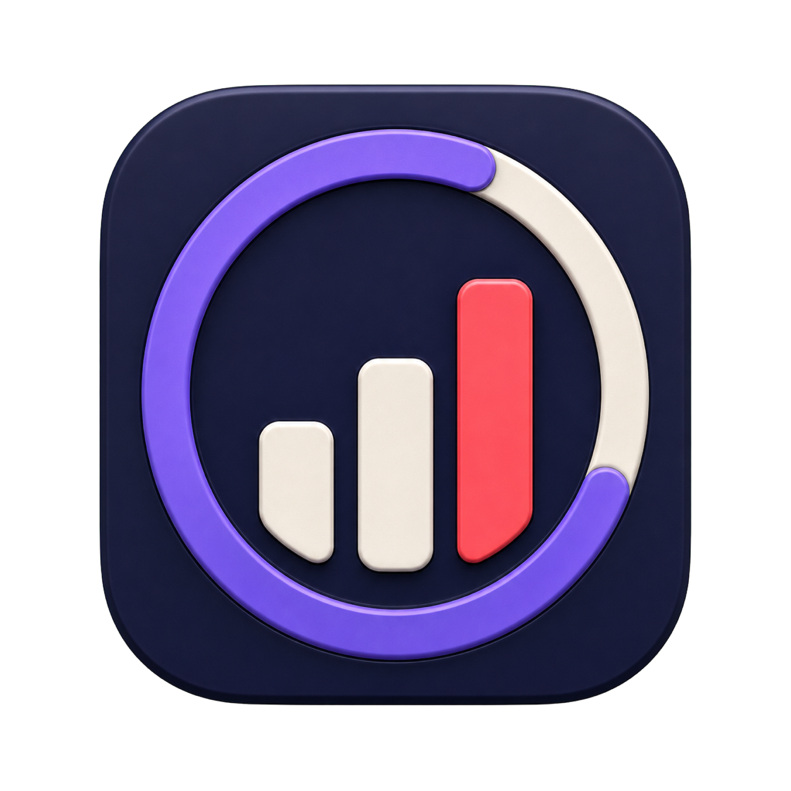
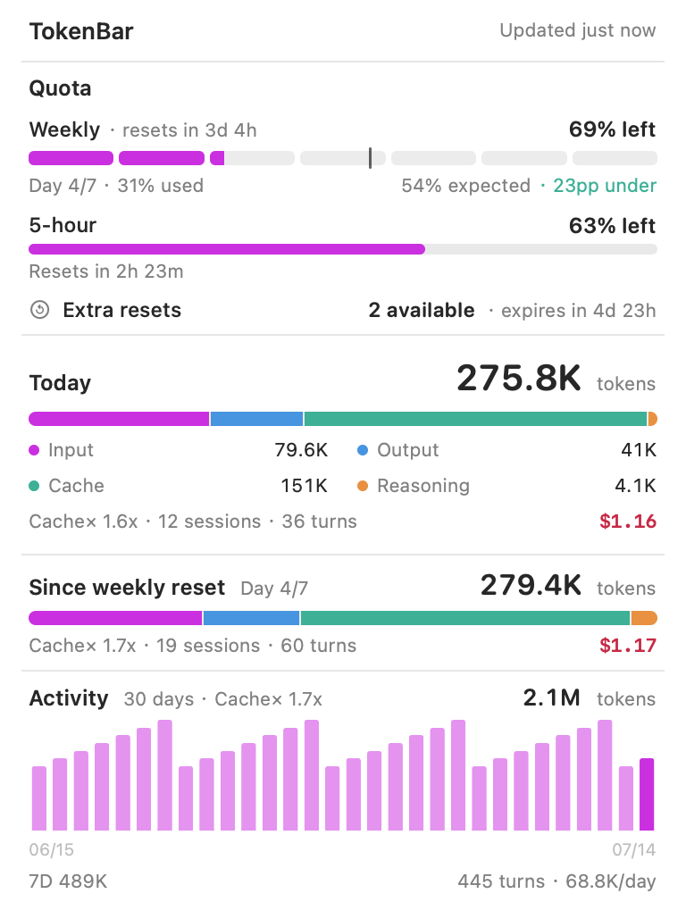
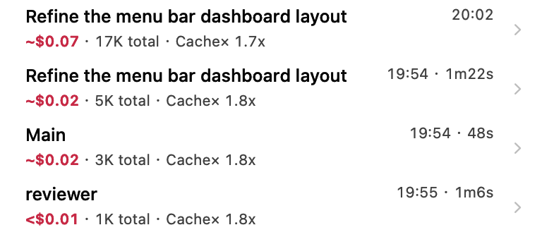

<p align="center">
  
</p>

<h1 align="center">TokenBar</h1>

<p align="center">
  Codex, Claude Code, and Grok Build quota and token activity, at a glance in your macOS menu bar.
</p>

<p align="center">
  
  
  
  <a href="LICENSE"></a>
</p>

<p align="center">
  
</p>

TokenBar is a native, standalone macOS menu bar app for Codex, Claude Code, and Grok Build. It combines each platform's quota windows with local token accounting, costs, session history, user turns, and main/subagent request details. It does not require CodexBar or Tokscale to build or run.

> TokenBar is an independent project and is not affiliated with or endorsed by OpenAI, Anthropic, or xAI.

## Highlights

- See one compact menu bar item with separate Codex, Claude, and Grok `T/W` sections.
- Click a provider section to open TokenBar directly on that platform's tab.
- Switch between the **Codex**, **Claude**, and **Grok** tabs; each tab uses the same TokenBar sections while optional quota rows collapse when that provider does not return them.
- Hide or restore the Claude and Grok sections and tabs immediately from Settings, without restarting TokenBar.
- Track every provider's quota window independently without mixing percentages or reset cycles.
- Track weekly and available 5-hour quota windows, their reset times, and Codex extra reset credits. A row stays hidden when its provider does not return that window.
- Optionally celebrate confirmed 5-hour or weekly resets with click-through, full-screen confetti launched from that provider's menu bar section.
- Compare weekly usage with a linear seven-day pace calculated from the last weekly reset, or switch to a five-workday pace that pauses on weekends.
- Review today and since-weekly-reset totals for input, output, cache, reasoning, estimated cost, sessions, and turns; Today also shows the estimated cost of each token category.
- Explore 7-day and 30-day activity, then hover a day to inspect usage by model.
- On the **Codex** tab only, track Codex Memory extraction (Phase 1) and consolidation (Phase 2) tokens by input, cached input, cache write, output, and reasoning output.
- Browse the selected platform's recent sessions, using provider-generated titles when available. Codex and Claude sessions open in their desktop apps; Grok sessions resume in Terminal from their original workspace.
- Drill down from a session to each root-prompt turn, then to the main and subagent requests that contributed to it.
- Compare weighted average generation throughput from local output, reasoning-token, and active model-request duration data at the day, session, turn, and physical-request levels.
- See `FAST` or `MIXED` badges on sessions, turns, and physical requests that used Codex Fast mode.
- Hover a physical request to load its full prompt and output, or click it to copy a stable Tokscale-compatible locator.
- Optionally combine privacy-redacted activity snapshots from Windows, Linux, and other Macs through a self-hosted HTTPS sync service; remote sessions are labeled by device and stay read-only.
- Choose a theme color, recent-session limit, background refresh interval, and whether full request content appears on hover.

## Screenshots

<p align="center">
  <strong>Turn and agent drill-down</strong><br><br>
  
</p>

_The screenshots use generated demo data and contain no real account or session content._

## Requirements

- macOS 14 or later.
- At least one supported client:
  - [Codex CLI](https://developers.openai.com/codex/cli/) installed and authenticated. Running `codex` in Terminal should work before starting TokenBar; `CODEX_CLI_PATH` can point to a nonstandard installation.
  - Claude Code installed, used at least once, and authenticated. TokenBar reads its local projects from `~/.claude/projects` (or `CLAUDE_CONFIG_DIR`) and its existing OAuth credential for quota.
  - [Grok Build](https://x.ai/cli) installed, used at least once, and authenticated. TokenBar reads durable local sessions and the latest CLI-written quota snapshot from `~/.grok` (or `GROK_HOME`).
- To build from source: Apple Swift 6.2 command-line tools and a recent stable Rust toolchain with Cargo.

TokenBar is currently distributed from source. There is no prebuilt, notarized GitHub release yet.

## Installation

Clone the repository, build the two native executables, and package the app:

```bash
git clone https://github.com/wuruoye/TokenBar.git
cd TokenBar
./Scripts/package_app.sh
open TokenBar.app
```

`package_app.sh` creates `TokenBar.app` for the current Mac architecture and ad-hoc signs it by default. It builds the Swift menu bar app and embeds the Rust activity helper in the bundle.

Repeated local builds that use Keychain-backed settings should use a stable signing identity. Put the exact identity name in the Git-ignored `.tokenbar-codesign-identity` file once; `package_app.sh` will reuse it unless `CODESIGN_IDENTITY` is set explicitly. This prevents each ad-hoc rebuild from getting a new code identity and prompting again for access to an existing Keychain item.

After upgrading from an ad-hoc build, TokenBar reads the legacy activity-sync credential once and immediately migrates it to a new Keychain item owned by the stable app identity. macOS can require one final authorization for that legacy read; later launches use only the migrated item.

```bash
printf '%s\n' 'Apple Development: Your Name (TEAMID)' > .tokenbar-codesign-identity
./Scripts/package_app.sh
```

For a Developer ID build, provide a signing identity:

```bash
CODESIGN_IDENTITY="Developer ID Application: Your Name (TEAMID)" \
  ./Scripts/package_app.sh
```

Signing with a Developer ID does not notarize the bundle; distribution still requires the normal Apple notarization workflow.

## Usage

1. Launch `TokenBar.app`. TokenBar appears only in the menu bar; it has no Dock icon.
2. Click a provider's `T/W` section to open its matching tab. Opening the menu refreshes local activity and any quota data older than one minute.
3. Use the three tabs to switch platforms without closing the menu. Quota, Today, Activity, and Recent Sessions all follow the selected tab.
4. Hover **Activity** for the daily chart and per-model breakdowns.
5. Hover **Codex Memory** for Today/30-day Phase 1 and Phase 2 details. If Codex is not configured yet, use the explicit enable button there or in Settings.
6. Click a recent session to open it in the matching desktop app or resume a Grok session in Terminal. Hover the row to inspect its turns; a turn represents one root user prompt and aggregates all main/subagent work attributed to that prompt.
7. If a turn has multiple contributing requests, hover it to expand the main and subagent rows. Hover a request again to load its full prompt and output.
8. Use **Copy Session** or click a request row to copy its stable locator.

Useful shortcuts:

- `Command-R`: refresh without closing the open menu.
- `Command-,`: open Settings.
- `Command-Q`: quit TokenBar.

The default background refresh interval is five minutes. Opening the menu always starts a fresh update, independent of that timer.

## How counting works

TokenBar normalizes Codex, Claude Code, and Grok Build into the same three activity levels:

1. **Session** — a root conversation within one platform. TokenBar prefers the Codex-generated title when available and otherwise falls back to the first useful prompt.
2. **Turn** — the interval beginning with a root user prompt and ending before the next root user prompt. Main-thread and subagent requests launched for that prompt are aggregated into the turn, including subagent work that finishes later.
3. **Physical request** — the original main or subagent activity recorded in a specific client session log. These rows retain their own platform, model, token, cache, cost, duration, prompt/output detail, and copy locator.

Platform is part of every aggregation and identity key, so sessions from different clients with the same raw ID remain separate. Claude Code's repeated streaming snapshots are deduplicated by message/request identity before totals are calculated.

Token totals contain input, output, cache-read, cache-write, and reasoning buckets. Codex and Grok report overlapping total fields; TokenBar converts them into disjoint buckets before aggregation so cache and reasoning are counted once. Complete Grok turn costs are provider-reported; partial or incomplete Grok costs stay unknown rather than appearing as zero-cost usage.

`Avg tok/s` divides generated output plus reasoning tokens by the summed active duration of the underlying model requests. Tool execution, polling, and other time between model requests stay in the displayed turn duration but are excluded from TPS. TokenBar omits TPS when a local transcript does not expose enough request-boundary timing to calculate it reliably.

Codex records Fast mode as the `priority` service tier (`fast` is also accepted for older logs); `default` and `standard` are treated as Standard. When every service-tier snapshot in one physical session agrees, TokenBar applies that tier to the whole session, including usage written before the first snapshot. If a session switches tier, TokenBar follows the timeline from each snapshot and leaves any prefix before the first snapshot unknown. Subagents inherit the last tier from their replayed parent context without counting the parent's earlier tier history as their own. A turn containing both Fast and Standard physical requests is marked `MIXED`.

`Cache` is the percentage of prompt tokens served from the cache:

```text
cache-read tokens / (input tokens + cache-read tokens + cache-write tokens) × 100%
```

Costs prefixed with `~` are compatibility estimates based on pricing data maintained inside TokenBar, not provider invoices. Provider-reported costs, when present in the source data, remain authoritative. TokenBar reads only the non-sensitive `auth_mode` field from the active Codex home's `auth.json` to choose the Fast basis. ChatGPT subscription sessions follow Codex credit consumption—GPT-5.4 uses 2× and GPT-5.5/5.6 use 2.5×—while API Key sessions follow API Priority pricing, where GPT-5.6 uses 2×. The underlying dollar estimates still use standard API token rates, so subscription totals are best understood as credit-weighted compatibility estimates. See OpenAI's [Codex Fast mode documentation](https://learn.chatgpt.com/docs/agent-configuration/speed#fast-mode), [pricing table](https://developers.openai.com/api/docs/pricing), and [Priority Processing guide](https://developers.openai.com/api/docs/guides/priority-processing). A model without an explicitly verified Fast multiplier keeps its standard estimate instead of receiving a guessed multiplier.

Codex reports `cached_input_tokens` and `cache_write_input_tokens` as subcategories of `input_tokens`. TokenBar separates those buckets internally so their rows add back to the provider's raw input total exactly once. In the dashboard, cache writes are included in **Input**, while **Cache** means cache reads; the internal split is retained so each category can use its own price. For GPT-5.6, cache writes use OpenAI's documented 1.25× uncached-input rate; models without a verified cache-write rate remain unpriced if a nonzero write is reported. See the [GPT-5.6 model guidance](https://developers.openai.com/api/docs/guides/latest-model#using-gpt-5-6).

Recognized OpenAI model IDs retain the estimate behind custom Codex gateways, and the unpriced research-preview `gpt-5.3-codex-spark` ID uses the public GPT-5.3-Codex rate so historical totals stay aligned with Tokscale. Unknown model families remain unpriced. For GPT-5.4, GPT-5.5, and GPT-5.6, TokenBar applies OpenAI's long-context rate to each physical model request whose raw input exceeds 272K tokens: uncached input, cache reads, and cache writes use 2× pricing, while output and reasoning output use 1.5× pricing for that request. The threshold is evaluated before turn, session, and daily aggregation. See OpenAI's [pricing table](https://developers.openai.com/api/docs/pricing).

Claude compatibility estimates use a reviewed built-in fallback plus Anthropic's official [pricing table](https://platform.claude.com/docs/en/about-claude/pricing). TokenBar checks the official Markdown catalog at most once every 24 hours, validates its document shape before caching it, strictly validates the table schema and rates before use, and keeps the previous catalog or built-in rates when the request or validation fails. Claude Code's 5-minute and 1-hour cache-write token buckets are priced separately when the transcript exposes that breakdown. Unknown model IDs still remain unpriced instead of inheriting a nearby model's rate.

Fast pricing never changes raw token/cache counts. Quota percentages come from Codex and are not multiplied again; quota and local token totals measure different things and should not be expected to map one-to-one.

### Codex Memory tokens

TokenBar runs a metrics-only OTLP/HTTP JSON receiver on `127.0.0.1:4318`. The receiver accepts only `POST /v1/metrics`, retains only `codex.memory.phase1.token_usage` and `codex.memory.phase2.token_usage`, and stores observations in `~/Library/Application Support/TokenBar/memory-telemetry.sqlite`. It reads histogram `sum`; histogram `count` is only the number of observations and is never treated as token usage.

The owner-only database keeps each observation plus a persisted series watermark. DELTA points are added once per unique interval. CUMULATIVE points add only the increase over the latest in-order watermark; duplicate and out-of-order exports add zero, while a new start time or resource series is counted independently. This state survives TokenBar and Codex process restarts. The Memory detail view reports how many raw observations are stored locally.

The main menu shows the 30-day Memory total, the Phase 1/Phase 2 split, and compact input/cache/output/reasoning fields. Its detail submenu adds Today/30 days selection, a daily stacked chart, complete token-type breakdowns for both phases, receiver/config status, collection timestamps, and the local observation count.

Collection is opt-in. When no existing `[otel]` section is present, **Enable Memory Metrics** appends user-level Codex settings that enable analytics, route metrics to TokenBar in JSON, and keep log, trace, and prompt export disabled. TokenBar creates a backup before changing the file. If `[otel]` already exists, TokenBar preserves it and asks you to configure its metrics exporter manually. Codex loads the exporter when its local process starts, so restart Codex or ChatGPT once after enabling. Collection starts with future Memory runs; TokenBar does not invent or backfill historical Phase 1 usage.

The UI distinguishes receiver health, the last OTLP connection from any Codex metric export, and the last recognized Phase 1 or Phase 2 export. A healthy receiver or OTLP connection alone does not mean that a qualifying asynchronous Memory run has occurred.

The memory histogram does not provide reliable pricing attribution. TokenBar therefore shows those tokens without a guessed cost. Reasoning output is exposed as its own diagnostic field but remains a subset of output, so the component rows should not be added together.

## Privacy

TokenBar is designed to keep session content local:

- The Rust helper reads Codex JSONL logs under `~/.codex/sessions` and `~/.codex/archived_sessions`, or the equivalent directory selected by `CODEX_HOME`.
- It reads Claude Code JSONL logs under `~/.claude/projects`, or the equivalent directory selected by `CLAUDE_CONFIG_DIR`.
- It reads Grok Build's `summary.json` and durable `updates.jsonl` files under `~/.grok/sessions`, or the equivalent directory selected by `GROK_HOME`.
- Codex-generated titles are read from `session_index.jsonl` in the same Codex home directory.
- Local activity parsing, turn attribution, and pricing never upload session content or read a Tokscale runtime cache. The only pricing update is an unauthenticated read of Anthropic's public pricing Markdown at most once every 24 hours; the validated file is stored at `~/Library/Application Support/TokenBar/anthropic-pricing.md` with owner-only permissions.
- Full prompt and output text is read lazily when a request detail menu opens and is retained in memory only for the current process.
- The persistent activity cache omits titles, prompt/output previews, and source paths, including those nested under physical requests. It is stored at `~/Library/Application Support/TokenBar/activity-snapshot.json` with owner-only permissions.
- The last successful provider quota snapshots are stored at `~/Library/Application Support/TokenBar/quota-snapshots.json`, also with owner-only permissions, so a temporary provider rate limit does not blank the menu.
- The optional Codex Memory receiver stores token counts, timestamps, metric names, deduplication fingerprints, and a small allowlist of process identity fields. It discards the full request body and never stores prompts, traces, logs, arbitrary metric attributes, or unrelated metrics.
- TokenBar does not send its own telemetry or analytics. The Codex Memory integration receives the two selected metrics over loopback only.

Quota is the intentional network-facing part of the Codex and Claude integrations. TokenBar asks the locally installed Codex app-server for Codex rate limits. For Claude it makes a read-only request to Anthropic's OAuth usage endpoint with the existing Claude Code credential from `.credentials.json` or the macOS Keychain; when a live refresh is unavailable, TokenBar can use Claude Desktop's recent local usage sample and labels that source in the quota header. A Claude Code statusline can also write only its subscriber rate-limit windows and sample time to `~/Library/Application Support/TokenBar/claude-rate-limits.json`; TokenBar uses valid future reset times from that private local snapshot without storing the rest of the statusline payload. Grok quota is different: TokenBar reads the latest billing snapshot already written to Grok Build's local unified log, and never reads Grok's `auth.json` or sends an authenticated Grok request. TokenBar does not refresh, rewrite, or copy provider credentials into its own cache. The optional Codex extra-reset lookup uses the existing Codex OAuth credential. If Codex's `config.toml` explicitly sets a custom HTTPS `chatgpt_base_url`, TokenBar honors that origin and sends the same bearer credential to it; redirects remain restricted to that exact HTTPS origin.

## Settings

Open **Settings** with `Command-,` to configure:

- **Theme color:** System, Blue, Purple, Green, Orange, or Pink.
- **Show Claude Code:** add or remove the Claude `T/W` section and Claude tab immediately. When hidden, TokenBar skips Claude quota refreshes and does not read the Claude credential from disk or the macOS Keychain.
- **Show Grok Build:** add or remove the Grok `T/W` section and Grok tab immediately. When hidden, TokenBar skips Grok quota-log refreshes.
- **Use weekdays only for weekly pace:** split weekly pace into five workdays and pause expected usage on Saturday and Sunday.
- **Statistics timezone:** UTC to match the Codex usage dashboard, or local time.
- **Recent sessions:** show 5 or 10 sessions before the **Show More** control.
- **Full request content:** enable or disable the last hover level for prompts and outputs.
- **Codex Memory:** inspect the loopback receiver and Codex configuration state, and explicitly enable metrics when no custom `[otel]` configuration exists.
- **Multi-device sync:** configure the optional HTTPS endpoint, Keychain-backed device access token, and this Mac's stable device identity. Headless Windows/Linux components and the self-hosted service are documented in [`Sync/README.md`](Sync/README.md).
- **Background refresh:** 1, 5, 10, or 15 minutes.
- **Reset celebrations:** play confetti for 5-hour resets, weekly resets, both, or neither, with a test button for previewing the animation immediately.

## Development

No sibling repository checkout is required. The Swift package contains the menu bar UI and independent provider quota clients; `Helper` contains the Codex, Claude, and Grok adapters plus the shared Rust activity aggregator.

### Build and run

For a development run, build the helper first so the Swift app can discover it:

```bash
cargo build --manifest-path Helper/Cargo.toml
swift run TokenBar
```

Build both projects without launching the app:

```bash
swift build
cargo build --locked --manifest-path Helper/Cargo.toml
```

### Test

The test suites use fixtures and do not require live provider accounts:

```bash
swift test
cargo test --locked --manifest-path Helper/Cargo.toml
```

When `Helper/Cargo.lock` changes, refresh the bundled Rust license catalog:

```bash
cargo install cargo-about --locked --features cli
./Scripts/generate_licenses.sh
```

### Package

```bash
./Scripts/package_app.sh
```

The packaging script supports these optional environment variables:

| Variable | Purpose |
| --- | --- |
| `CODESIGN_IDENTITY` | Signing identity; overrides `.tokenbar-codesign-identity` and otherwise defaults to ad-hoc signing (`-`). |
| `TOKENBAR_APP_PATH` | Output path for the app bundle. |
| `TOKENBAR_BUNDLE_IDENTIFIER` | Override `CFBundleIdentifier` while packaging. |
| `TOKENBAR_BUNDLE_DISPLAY_NAME` | Override the displayed bundle name. |
| `TOKENBAR_RUST_TARGET_DIR` | Override the Cargo target directory used by the packaging script. |
| `TOKENBAR_HELPER_PATH` | Point development builds at an explicit helper executable. |

### Create a release

`Scripts/release_app.sh` builds the Swift app and Rust helper for both Apple silicon and Intel, merges each executable into a Universal 2 app, signs the complete bundle with an Apple [Developer ID Application certificate](https://developer.apple.com/help/account/certificates/create-developer-id-certificates/) and hardened runtime, submits it to Apple's [notary service](https://developer.apple.com/documentation/security/notarizing-macos-software-before-distribution), staples the ticket, removes AppleDouble/resource-fork metadata, validates the result with Gatekeeper, and creates a `ditto --norsrc` zip plus SHA-256 checksum.

Store notarization credentials in the macOS Keychain once:

```bash
xcrun notarytool store-credentials tokenbar-notary
```

Then create a formal release:

```bash
CODESIGN_IDENTITY="Developer ID Application: Your Name (TEAMID)" \
NOTARYTOOL_PROFILE="tokenbar-notary" \
  ./Scripts/release_app.sh
```

The script also accepts an App Store Connect API key file outside the repository; run `./Scripts/release_app.sh --help` for the exact contract. Apple-ID passwords must first be stored in a `notarytool` Keychain profile and are never accepted as build environment variables. The script removes all notarization variables from the build environment before invoking Swift or Cargo. A formal release fails unless a Developer ID Application identity and exactly one notarization authentication mode are configured.

For a local Universal 2 build without Apple submission:

```bash
BUILD_ONLY=1 ./Scripts/release_app.sh
```

Build-only output is ad-hoc signed and not notarized. It is useful for architecture and packaging checks, but is not a distributable release; Gatekeeper may require **Right-click → Open** on another Mac. Release artifacts are written under `dist/TokenBar-<version>/` (or `dist/TokenBar-<version>-build-only/`) unless `TOKENBAR_RELEASE_DIR` is set.

The release host needs both Rust macOS targets. Install a missing target with `rustup target add x86_64-apple-darwin` or `rustup target add aarch64-apple-darwin`.

After the formal script passes notarization and Gatekeeper validation, publish the zip and checksum as [GitHub Release](https://docs.github.com/en/repositories/releasing-projects-on-github/about-releases) assets:

```bash
VERSION="$(plutil -extract CFBundleShortVersionString raw -o - Resources/Info.plist)"
gh release create "v$VERSION" \
  "dist/TokenBar-$VERSION/TokenBar-$VERSION-macos-universal.zip" \
  "dist/TokenBar-$VERSION/TokenBar-$VERSION-macos-universal.zip.sha256" \
  --target main \
  --title "TokenBar $VERSION" \
  --generate-notes
```

TokenBar does not embed Sparkle yet, so GitHub Releases are the update channel for the initial version. Adding in-app updates later requires signing the embedded Sparkle framework and nested services, publishing an EdDSA-signed appcast, and validating upgrades from the previous public build.

## Project structure

```text
Sources/TokenBar/             AppKit/SwiftUI menu bar UI
Sources/TokenBarCore/         Models, quota client, caching, and presentation logic
Helper/                       Codex/Claude/Grok parsers and shared activity aggregator
Sync/                         Windows/Linux headless clients, Linux service, and protocol
Tests/TokenBarCoreTests/      Swift behavior and fixture tests
Resources/                    Bundle metadata and app icon assets
Scripts/package_app.sh        Build, embed, sign, and verify TokenBar.app
Scripts/release_app.sh        Build, notarize, and archive a Universal 2 release
Scripts/build_icon.sh         Regenerate AppIcon.icns from the 1024 px source
Scripts/generate_licenses.sh  Refresh the bundled Rust dependency licenses
```

Each platform's quota and the shared activity source maintain independent state. One provider's authentication failure does not erase another provider's last valid quota snapshot, and a quota failure does not hide local activity.

## Troubleshooting

### Quota is unavailable

Run `codex` in Terminal and confirm that it is installed and authenticated. TokenBar checks common package-manager locations and the login-shell path; set `CODEX_CLI_PATH` when using another location. TokenBar does not implement a separate login flow.

### The 5-hour quota row is missing

This is intentional when Codex returns no 5-hour window. Weekly quota can still remain available.

### No local activity appears

Confirm that the client has created JSONL files under `~/.codex/sessions`, `~/.codex/archived_sessions`, `~/.claude/projects`, or `~/.grok/sessions`. If you use a custom home, launch TokenBar with the matching `CODEX_HOME`, `CLAUDE_CONFIG_DIR`, or `GROK_HOME` environment.

### An extra reset count is missing

Extra resets are best-effort and require current OAuth credentials in the Codex home. A failure here does not hide the regular quota windows.

### A cost is absent

TokenBar leaves requests unpriced when neither the log nor its internal pricing data has a trustworthy rate for the model.

### A development build cannot find the helper

Run `cargo build --manifest-path Helper/Cargo.toml` before `swift run TokenBar`, or set `TOKENBAR_HELPER_PATH` to the helper executable.

### Another Mac says TokenBar cannot be opened

`Scripts/package_app.sh` creates a host-architecture, ad-hoc-signed development app. It is not intended for direct distribution. Use the Developer ID and notarization release flow above to produce a Universal 2 zip that opens normally on supported Apple silicon and Intel Macs. A build-only package can be opened manually with **Right-click → Open**, but it remains unnotarized and should not be published as a release.

## Acknowledgements

- [CodexBar](https://github.com/steipete/CodexBar) inspired TokenBar's focused native menu bar experience; its quota protocol and reset-celebration behavior informed TokenBar's standalone integration.
- [Tokscale](https://github.com/junhoyeo/tokscale) established many of the local Codex and Claude Code accounting, parsing, quota, and compatibility semantics used by TokenBar. Adapted portions are used under the MIT License; see [THIRD_PARTY_NOTICES.md](THIRD_PARTY_NOTICES.md).
- [Grok Build](https://github.com/xai-org/grok-build) publishes the durable session-update and usage contracts used by TokenBar's independent Grok adapter. The reference implementation is available under Apache-2.0.

TokenBar is a standalone implementation: none of these projects is a build-time or runtime dependency. Adapted MIT-licensed portions are retained in [THIRD_PARTY_NOTICES.md](THIRD_PARTY_NOTICES.md).

## Contributing

Issues and focused pull requests are welcome. Please keep changes scoped and include tests for parsing, accounting, quota normalization, caching, or menu presentation behavior when applicable.

Before opening a pull request, run:

```bash
swift test
cargo test --locked --manifest-path Helper/Cargo.toml
```

For visual changes, include a screenshot made with demo data.

## License

TokenBar is available under the [MIT License](LICENSE). Third-party attributions are listed in [THIRD_PARTY_NOTICES.md](THIRD_PARTY_NOTICES.md).
